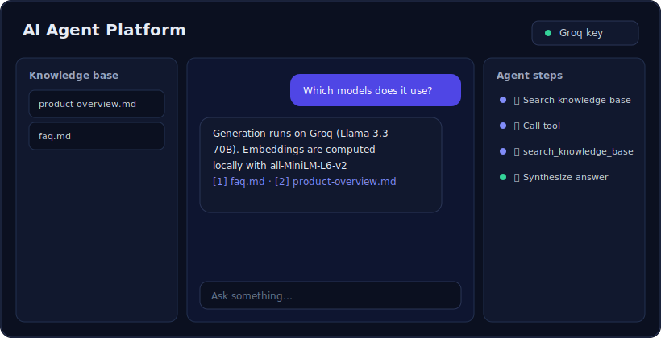
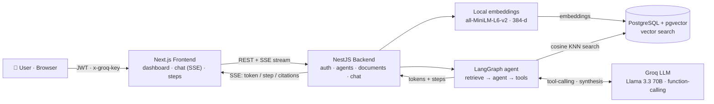
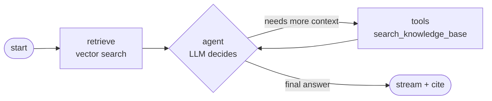

# AI Agent Platform

> Create AI agents with their own knowledge base, upload documents, and chat with
> answers grounded in those documents — with inline citations and a live view of
> the agent's reasoning steps.

Each agent runs a **multi-step RAG pipeline**: the question is embedded and matched
against a `pgvector` store, a **LangGraph** agent decides whether to pull more
context via **Groq function-calling**, and the final answer is streamed back token
by token with citations to the source chunks.

**Live demo:** coming soon · **Run it locally in one command:** see [Run locally](#run-locally).

<!-- Replace docs/demo.svg with a real screenshot or GIF of the chat + steps panel -->
<p align="center">
  
</p>

---

## What it does

- 🧠 **Create agents** — each with its own system prompt and knowledge base.
- 📄 **Upload documents** (TXT / Markdown / PDF) → chunked → embedded → stored in pgvector.
- 💬 **Chat with streaming** — answers stream in token by token over SSE.
- 🔎 **Multi-step RAG** — the agent retrieves, and can call a `search_knowledge_base`
  tool to pull more context before answering (real ReAct-style tool-calling).
- 📌 **Citations** — every answer links back to the exact source chunks (`[1]`, `[2]`…).
- 🪜 **Agent steps panel** — a live timeline of what the agent did (search → tool → synthesis).
- 🔑 **BYOK (bring your own key)** — users paste their own Groq API key in the UI; it is
  stored in the browser and **never persisted or logged** server-side.

---

## Architecture



**The agent graph** (LangGraph `StateGraph`) — a ReAct loop with a retrieval-backed tool:



> **Why local embeddings?** Groq only serves LLM inference + function-calling (no
> embeddings endpoint), so embeddings are computed locally with
> `@xenova/transformers`. That keeps the whole thing free apart from a single
> (user-provided) Groq key.

---

## Tech stack

| Layer        | Tech                                                          |
|--------------|--------------------------------------------------------------|
| Frontend     | Next.js 14 (App Router) · TypeScript · Tailwind              |
| Backend      | NestJS 10 · Prisma 5                                          |
| Database     | PostgreSQL 16 · **pgvector** (HNSW index, cosine distance)   |
| LLM          | **Groq** — Llama 3.3 70B + function-calling                  |
| Orchestration| **LangGraph** — `retrieve → agent → tools` state graph       |
| Embeddings   | `@xenova/transformers` · all-MiniLM-L6-v2 · 384-d · local    |
| Auth         | JWT (Passport) · bcrypt                                       |
| Infra        | Docker Compose (Postgres + backend + frontend)               |

---

## Run locally

You only need **Docker** (with Docker Compose) and a free **Groq API key**.

```bash
# 1. Clone
git clone https://github.com/batyrq/ai-agent-platform.git
cd ai-agent-platform

# 2. Configure — copy the template (Groq key is optional thanks to BYOK)
cp .env.example .env

# 3. Bring up the whole stack
docker compose up -d --build

# Frontend → http://localhost:3000
# Backend  → http://localhost:4000/health
```

On first start the backend downloads the embedding model (~90 MB) and seeds a demo
agent, so give it a minute. Then sign in and paste your Groq key via **⚙ Groq key**
(get a free one at [console.groq.com/keys](https://console.groq.com/keys)).

### Demo login (seeded automatically)

- **Email:** `demo@aiap.dev` · **Password:** `demo1234`
- Comes with a ready agent **"Помощник по продукту"** and two indexed documents —
  ask it something like *"Which models does the platform use?"*.

---

## How it works

**RAG ingestion** (`backend/src/documents`, `backend/src/rag`)
`file → text → chunk (≈900 chars, 150 overlap) → 384-d embedding → pgvector`.
Search runs exact cosine KNN (`embedding <=> query`), accelerated by an HNSW index.

**Agent orchestration** (`backend/src/chat/graph.ts`)
A LangGraph `StateGraph` runs `retrieve → agent → tools` in a ReAct loop. The model
either answers or calls `search_knowledge_base` for more context; the loop is bounded
by a max-iteration guard.

**Streaming** (`backend/src/chat/chat.service.ts`)
The graph is read with `streamMode: ["updates","messages"]` and bridged to SSE: node
updates become **step** events (the steps panel) and LLM tokens become **token**
events (the live answer). Citations are emitted at the end.

**BYOK** (`backend/src/chat/chat.controller.ts`)
The Groq key arrives per-request in the `x-groq-key` header, is used only to call
Groq, and is never written to the database or logs. A server-side `GROQ_API_KEY` is
an optional fallback.

---

## Project structure

```
ai-agent-platform/
├── docker-compose.yml        # postgres + backend + frontend
├── db/init.sql               # CREATE EXTENSION vector
├── backend/                  # NestJS
│   ├── prisma/               # schema, migration, seed
│   └── src/
│       ├── auth/  agents/  documents/
│       ├── rag/              # embeddings + pgvector search
│       └── chat/             # LangGraph + Groq + SSE
└── frontend/                 # Next.js (dashboard, chat, steps, upload)
```

---

## Roadmap

- [ ] Live hosted demo (Vercel + Railway)
- [ ] Streaming markdown rendering in chat
- [ ] Per-agent model selection
- [ ] Re-ranking on top of vector search

---

## License

MIT
